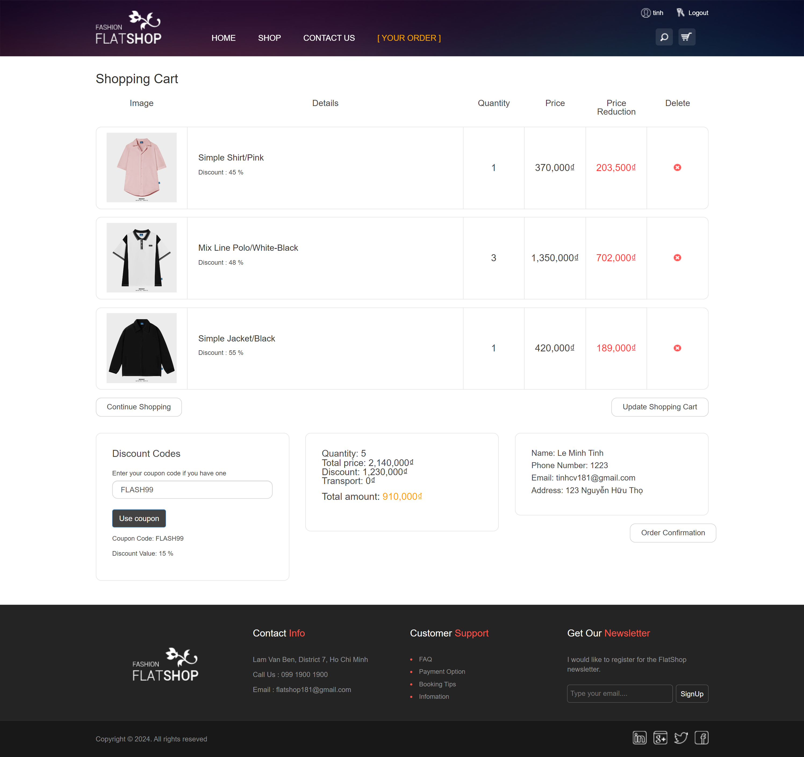

# eFashionStore

This project is a fully functional e-commerce website specializing in selling clothing items. It features customer and admin functionalities, offering a smooth shopping experience for users and comprehensive management tools for administrators.

## Features

### Customer Functions
- **Home Page**  
  The homepage displays featured products and categories.
  
  
  
- **Product Categories and Search/Filter**  
  Customers can browse products by categories or use search and filter options to find specific items.
  
  
  
- **Product Details**  
  Each product page shows detailed information about the item, including price, sizes, colors, and availability.
  
- **Comments/Reviews**  
  Customers can leave comments and reviews on products to share their feedback.
  
  
  
- **Shopping Cart and Order Placement**  
  Users can add items to the shopping cart, review their selections, and place orders.
  
  
  
- **Order History and Order Details**  
  Customers can view their past orders and track the status of ongoing purchases.
  
  
  

- **Contact Page**  
  A contact page allows users to get in touch with the store.
  
  

  - **User Registration, Login, and Account Management**  
  Customers can create accounts, log in, recover passwords, and manage their account details.
  
  
  

### Admin Functions

- **CRUD Operations for Products, Users, Coupons, and Sales**  
  Admins can perform create, read, update, and delete operations on products, users, coupons, and sales records.
  
  
  
  
  
  
  

## Database Structure
### ER Diagram:
Include an entity-relationship diagram (ERD) to visualize how the database tables are related.

  

## Technologies Used
- **Frontend:** HTML, CSS, JavaScript, Bootstrap
- **Backend:** ASP.NET MVC, Entity Framework, SQL Server
- **Authentication:** ASP.NET Identity, BCrypt
